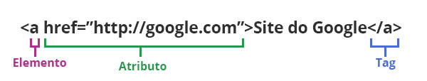

# CURSO DE HTML E CSS

#### Escolhendo um editor de texto

Baixe um dos editores abaixo:

  - [Sublime Text](http://www.sublimetext.com/3)
  - [Atom](https://atom.io/)
  - [Brackets](http://brackets.io/)
  - [Notepad++](https://notepad-plus-plus.org/)


# 1 - O que é HTML

#### HTML
HTML (abreviação para a expressão inglesa HyperText Markup Language, que significa Linguagem de Marcação de Hipertexto) é uma ``linguagem de marcação`` utilizada na construção de páginas na Web.

W3C o Consórcio World Wide Web (W3C) é um consórcio internacional no qual organizações filiadas, uma equipe em tempo integral e o público trabalham juntos para desenvolver padrões para a Web. Liderado pelo inventor da web Tim Berners-Lee e o CEO Jeffrey Jaffe, o W3C tem como missão Conduzir a World Wide Web para que atinja todo seu potencial, desenvolvendo protocolos e diretrizes que garantam seu crescimento de longo prazo.
[Membros](http://www.w3.org/Consortium/Member/List)

Lembre-se! HTML serve para compartilhar.

Nós fazemos a Web :)

# 2 - Conhecendo a Sintaxe

No HTML temos:

- **Elementos**
- **Atributos**
- **Tags**




```html

<!-- elemento, tag e atributo -->
<tag>Conteúdo</tag>

<tag atributo1="valor1" atributo2="valor2">Conteúdo</tag>

<!-- hierarquia -->
<pai>
  Tarço
  <filho>
    Aroni
    <neto>Daniel</neto>
  </filho>
</pai>

<pai>
  Tarço
  <filho>
    Aroni
    <neto>Daniel</neto>
    <neto>Gabriela</neto>
  </filho>
  <filho>
    Auri
    <neto>Natália</neto>
    <neto>Rafaela</neto>
  </filho>
</pai>

```


# 3 - Estrutura de uma página HTML


Primeiramente é necessário que o arquivo seja criado com a extensão __.html__.

O HTML requer a estrutura básica de declarações e elementos:

- **&lt;!DOCTYPE html&gt;**
  - ( Document type declaration) - informa aos browser qual a versão do HTML que será usada (Strict mode, Standart Mode, Box Model).
E usaremos a versão mais recente do HTML5.

- **&lt;html&gt;**
  - É onde começa nosso documento.

- **&lt;head&gt;**
  - É onde vai informações de metadados, como titulo que aparece na aba do browser, links para arquivos de estilo, scripts e qualquer metadado necessário como open graph ( og:facebook, og:twitter ). Tudo que fica dentro desta Tag, não será visível na tela.
  - charset: utf-8, ISO-8859-1 ou entidades HTML como ``raz&atilde;o``.
  - lang="pt-BR" - Você diz para o browser qual a linguagem pa


- **&lt;body&gt;**
  -  É onde vaí todo conteúdo visível.

```markup
<!DOCTYPE html>
<html lang="pt-BR">
  <head>
    <meta charset="utf-8">
    <title>Olá Universo</title>
  </head>
  <body>
    <h1>Olá Universo</h1>
    <p>Essa é uma página Web!</p>
  </body>
</html>
```


# 4 - Tipos de elementos HTML

```html
<!-- Tags para Seção de Conteúdo -->
<h1> title h1 </h1>
<h2> title h2 </h2>
<h3> title h3 </h3>
<h4> title h4 </h4>
<h5> title h5 </h5>
<h6> title h6 </h6>

<!-- Tags Conteúdo de Texto -->
<div>Div o mais usado antes do html5</div>

<hr> <!-- separador -->

<ul>
  <li>item 1</li>
  <li>item 2</li>
</ul>

<ol>
  <li>pato</li>
  <li>gato</li>
  <li>cachorro</li>
</ol>

<p>parágrafo</p>

<!-- tabelas -->
<table>
  <thead>
    <tr>
      <th>Nome</th>
      <th>Cor</th>
    </tr>
  </thead>
  <tbody>
    <tr>
      <td>Marcos</td>
      <td>Amarelo</td>
    </tr>
    <tr>
      <td>Suzana</td>
      <td>Rosa</td>
    </tr>
    <tr>
      <td>João</td>
      <td>Marron</td>
    </tr>
  </tbody>
</table>

<!-- Tags Inline -->
<b>negrito</b>
<strong>negrito</strong> <!-- mais importante -->
<i>itálico</i>
<br> <!-- quebra de linha -->
<small>letra menor</small>
<span>sem significado, é o elemento mais genêrico, mas é muito usado</span>
<u>underline</u>

<!-- Tag de Link Âncora -->
<a href="https://developer.mozilla.org" title="Mozzila Developer">MDN</a>

<!-- Tag de Imagem -->


<!-- Tag de Link com Imagem -->
<a href="https://meusite.com.br" title="Meu Site">
  
</a>


```


# 5 - Minha Primeira Página HTML

- Crie um arquivo chamado ``index.html``.
- Colocar ``title`` e um ``h1`` com seu nome
- ``h2`` com resumo de você
- Um ``div`` com uma lista ``ul`` com suas qualidades
- Um ``div`` com uma lista ``ol`` com seus defeitos
- Um ``div`` com uma tabela de coisas que você ainda vai tomar coragem e fazer, contendo no ``thead`` ( O que, Quando, Porque Não fez Ainda).
- Um ``div`` com uma imagem de algo que goste com um link apontando para uma arquivo chamado ``imagem.html``
- Agora crie dentro de cada ``div`` uma tag ``a`` contendo um ``h1`` com seu respectivo título. Os links serão apontados por um arquivo com o mesmo nome do título.
- Cada arquivo criado vai conter um menu com todos os links.
- Vamos navegar entre os links.
- Use negrito, itálico etc...

 [Link para os Exemplos](examples/html/primeira-pagina/index.html)

# 6 - O que é CSS

CSS Cascading Style Sheets (CSS) é uma linguagem de folhas de estilo utilizada para definir a apresentação de documentos escritos em uma linguagem de marcação, como HTML ou XML. O seu principal benefício é a separação entre o formato e o conteúdo de um documento.


#### O Efeito Cascata

O CSS trabalha como seu nome diz, em cascata. Todos estilos são computados de cima para baixo, fazendo com que sejam adicionados ou sobrescrito.

Também possui uma ordem de prioridade que não iremos debater neste curso, mas fica o link para saber mais.

[Maujor explica Especificidade CSS](http://www.maujor.com/tutorial/especificidade.php).

#### Seletores CSS

- __Elemento__: Usando o nome da tag. ``div``.
- __Id__: Colocando uma hashtag seguido do nome criado. ``#bilbo``
- __Classe__: Colocando um ponto seguido do nome criado. ``.humano``

__Dica__: Prefira usar sempre ``classes``. Para nomes use letras minúsculas e separados por ``-`` ou ``_``.

##### Seletores baseados em relacionamentos

- __A E__
  - Seleciona qualquer elemento ``E`` que seja um descendente de ``A`` ( filho, filho do filho etc ...)
- __A > E__
  -   Seleciona qualquer elemento ``E`` que seja um filho direto de ``A``
- __E:first-child__
  -   Seleciona qualquer elemento ``E`` que seja o primeiro filho de seu pai.
- __B + E__
  -  Seleciona qualquer elemento ``E`` que sejá seu próximo irmão. Ou seja, o próximo filho depois dele.

Depois você combina tudo isso e faz coisas incríveis.

#### Aplicando os Estilos

##### 1 - Diretamente no elemento

```markup
<span style="color:#fff;background: #000">Olá</span>.
```

##### 2 - Dentro do documento HTML, abrindo a tag ``<style>``.

```markup
<style>
  span {
    color:#fff;
    background: #000;
  }
</style>

```

##### 3 - De um arquivo externo com a extensão ``.css``, no qual devemos importar dentro da tag ``<head>``.

```markup
<link rel="stylesheet" href="estilo.css">
```
Opte por sempre usar arquivos externos, salvo algumas exceções:

Exemplo da sintaxe:

```css
elemento {
  atributo: valor;
}

p {
  text-align: center;
  color: #ffffff;
}

.classe {
  background: #000;
}

#identificador {
  margin: 0 auto;
}

.classe p {
  font-size: 16px;
}

#id_unico .class p {
  text-align: center;
}

```

#### Principais Atributos

##### Texto e Fontes

- font
- font-family
- font-size
- font-weight
- font-style
- font-variant
- line-height
- letter-spacing
- word-spacing
- text-align
- text-decoration
- text-indent
- text-transform
- vertical-align
- white-space

##### Cores e Fundos

- color
- background-color
- background
- background-image
- background-repeat
- background-position
- background-attachment
- background-size

##### Box Model: margins, padding e borders

- margin
- margin-top
- margin-right
- margin-bottom
- margin-left
- padding
- padding-top
- padding-right
- padding-bottom
- padding-left
- border
- border-top
- border-right
- border-bottom
- border-left
- border-width
- border-top-width
- border-right-width
- border-bottom-width
- border-left-width
- border-style
- border-top-style
- border-right-style
- border-bottom-style
- border-left-style
- border-color
- border-top-color
- border-right-color
- border-bottom-color
- border-left-color

##### Formatação Visual: dimensão, display e posicionamento

- width
- height
- min-width
- max-width
- min-height
- max-height
- position
- top
- right
- bottom
- left
- clip
- overflow
- z-index
- float
- clear
- display
- visibility

Vamos ver alguns exemplo na prática

[Link para os Exemplos](examples/css/index.html)


##### Colocando estilo em nossa página
Aqui vamos aplicar alguns estilos em nossa ``Primeira Página HTML``. Seja criativo, coloque algumas classes na tua página e use css para dar uma vida.

##### Usando divisores

Os divisores separam em blocos nossas páginas HTML. Geralmente usamos a tag ``div`` para isso, mas com o HTML5 esses divisores ganharam semântica. ( header, section, article, iside, footer )

##### Box Model e Formatação visual.

Vamos ver alguns exemplos de como estruturar nossas páginas usandos as propriedades:

```css
.test {
  margin: 10px;
  padding: 20px;
  width: 400px;
  height: 100px;
  border: solid 1px red;
}

```

##### Comentários em CSS

```css
/* O que escrever aqui não será interpretado */
```


##### Abreviaçõesss

Para facilitar, o CSS trás em sua sintaxe alguns atalhos:

```css
.test {
	/* margin e padding se usa desta forma*/
	margin-top: 10px;
	margin-right: 20x;
	margin-bottom: 30px;
	margin-left: 40px
	margin: 10px 20px 30px 40px;  /* top right bottom left */
	margin: 10px 20px 10px; /* top right/left bottom */

	border-top-style: solid;
	border-top-width: 1px;
	border-top-color: #000;
	border-top: solid 1px #000; /* style width color */
	border: solid 1px #000;

	font-style: italic;
	font-variant: bold;
	font-weight: 100;
	font-size: 14px;
	line-height: 30px;
	font-family: Arial, serif;
	font: italic bold 12px/30px Georgia, serif;
	/* font-style font-weight font-size/line-height font-family */


}
```

[Link para os Exemplos](examples/css/index.html)


# Layout


Vamos aprender alguns truques para criação de layout's em HTML/CSS.


### Display

Todos elementos possuem por padrão um tipo de display, geralmente:

- ``block``
- ``inline``

E geralmente usamos também:

- ``inline-block``
- ``none``

Isso porque podemos alterar o valor padrão do display de qualquer elemento. Existem outros valores para display, mas vamos estudar apenas esses 4.

#### display: block

O block sempre quebra um nova linha e tenta ocupar o quanto puder dos espaços ao lado (direita esquerda).

Elementos principais do tipo block são:

- div
- p
- h1, h2, h3, h4,h5,h6
- form
- header, footer, section ( tags do html5 )

```css
.test {
  display: block;
}

```


#### display: inline

O inline nunca quebra linha, ele segue o fluxo normal de onde estiver.

Elementos principais do tipo inline são:

- span
- b
- i

```css
.test {
  display: inline;
}

```


#### display: none

O none faz com que o elemento fique escondido ( não é mostrado no html ). É geralemente usado com Javascript para esconder elementos dinamicamente. OBS: Existe a propriedade ``visibility: hidden`` que também esconde o elemento, mas ele continua a ocupar o espaço no documento.

```css
.test {
  display: none;
}

```

#### display: inline-block

O elemento fica **inline**, mas se comporta como um **block**, ou seja, ele não irá quebrar a linha, mas aceitará atributos de elementos block como width, height, margin, padding.

```css
.test {
  display: inline-block;
}

```

[Link para os Exemplos](examples/display/index.html)


### Margin Auto e Max Width

##### margin: auto
Um dos truques muito usados é o **margin: 0 auto**. Isso porque quando você atribui o valor **auto**, faz com que o elemento calcule o espaço ocupado e o restante distribui para cada lado, fazendo com que o elemento fique **centralizado**.

Claro que se você informar uma largura fixa e redimensionar o browser para um tamanho menor que o informado, haverá a **barra de rolagem**, para isso vamos para o próximo truque.

```css
.test {
  margin: 0 auto;
}

```

##### max-width:

Para fazer com que o block não gere uma barra de rolagem, você usa **max-width: 700px**, isso faz com que o elemento só respeite o tamanho de no máximo 700px, caso contrário é como não houvesse informado tamanho algum.

```css
.test {
  max-width: 700px;
}

```


[Link para os Exemplos](examples/margin.html)


### Box Model


A propriedade **width** é influenciada também por outras propriedades como __padding__ e __border__.

Isso faz com que tenhamos que calcular nosso layout sempre somando essas 3 propriedades, o que sempre foi um problema.

Por isso foi criada a propriedade __box-sizing__, quando você define __box-sizing: border-box;__  em algum elemento, faz com que o padding e border faça agora parte da soma total do width. Assim fica mais intuitivo e não precisa ficar fazendo cálculos.

Essa propriedade funciona apenas do IE8+, ou seja, usaremos sempre.

```css
.test {
  -webkit-box-sizing: border-box;
       -moz-box-sizing: border-box;
            box-sizing: border-box;
}

```

[Link para os Exemplos](examples/box-model.html)


### Position

Para criação de layouts, é essencial entender a propriedade __position__, pois ela é a causa de muita dor de cabeça para quem começa com Html e CSS.


- __position: static__
  - É o default para todos os elementos, e significa que não se tem nenhuma posição definida.

- __position: relative__
  - Significa que não se tem nehuma posição definida ainda, mas agora responderá a propriedades como ``top``, ``right``, ``bottom`` e ``left``, e usa sua própria posição como base. Não influencia a posição de outros elementos.

- __position: fixed__
  - É a famosa posição fixa, o elemento ficará sempre no lugar onde foi posicionado, mesmo havendo rolagem de página. Responde para as propriedades ``top``, ``right``, ``bottom`` e ``left`` e usa a ``viewport`` como posição base.

- __position: absolute__
  - Essa posição é __fixed__ também, mas ela usa como base algum elemento relativo, ou seja, algum elemento **pai** que seja um __position: relative__, caso não haja nenhum, usará o **body**.

```css
.test {
  position: relative;
}

```

[Link para os Exemplos](examples/position.html)

### Float

Faz com que o elemento se torne flutuante, tanto ``left`` quando ``right``. Essa propriedade é bastante usada, mas possui algumas armadilhas.

```css
.test {
  float: left;
}
```

[Link para os Exemplos](examples/float/index.html)

### Clearfix

É uma técnica para se trabalhar com elementos flutuantes, para que os mesmos não quebrem em cima de outros elementos.

Hoje essa técnica está sendo substituida pelo uso de ``display: inline-block`` e ``Flexbox`` porém este último ainda não é suportado por todos os browsers.

Mas ainda é a técnica mais usada, especialmente em ``css grids``, assunto para outro curso.

```css
.test {
  overflow: auto;
  clear: both;
}
```

[Link para os Exemplos](examples/clearfix/index.html)


### Width com porcentagem

Quando usamos porcentagem no width de um elemento, ele tem como base o seu elemento **pai**, e isso nos permite ter uma flexibilidade ótima na construção de layouts.

```css
.teste {
  float: left;
  width: 50%;
}
```

[Link para os Exemplos](examples/width-com-porcentagem/index.html)


### Media queries

Utilizamos Media Types com uma ou mais expressões com as características de uma determinada media, para definir formatações diferentes para diversos dispositivos.

Media queries é a forma que criamos sites responsivos. ``Responsive Web Design``.

[+ sobre media queries](https://developer.mozilla.org/en-US/docs/Web/CSS/Media_Queries/Using_media_queries)

Podemos usar também a meta tag ``<meta name="viewport" ...``, onde podemos informar os atributos:

- __width__: Onde informamos o width mínimo para o conteúdo. Exemplo: ( 320, device-width )
- __initial-scale__: Escala inicial de zoom. Exemplo: (0.5, 1, 2 )
- __maximum-scale__: Escala máxima.
- __minimum-scale__: Escala mínima.

[+ sobre viewport](https://dev.opera.com/articles/an-introduction-to-meta-viewport-and-viewport/)

```markup
<meta name="viewport" content="width=320, maximum-scale=2, minimum-scale=0.5, initial-scale=1">
```

[Link para os Exemplos](examples/media-queries/index.html)

Sabendo todas esses truques, podemos agora criar nosso layout.


### Medidas

Em Css podemos usar várias unidades de medida, mas iremos usar apenas uma medida absoluta e uma relativa:

- __px__: 10px
- __em__: ``16px equivale a 1em`` / 18px/16 = 1.125em / 32px/16 = 2em

[MDN Unidades de Medida CSS](https://developer.mozilla.org/en-US/docs/Web/CSS/length)


### CSS Reset X Normalize

Basicamente o CSS Reset limpa os estilos padrões dos principais elementos HTML que já possuem uma formatação padrão nos browser, removendo cores, tamanhos de fonte, margins, paddings e etc.

Isso porque cada browser tem suas própria especificação de estilo para cada elemento, por exemplo o tamanho da fonte para (h1, h2, h3 ...) são diferentes para cada browser.


### Meu Primeiro Layout Responsivo

Vamos criar nosso primeiro layout, e por padrão, todos layouts devem ser responsivos.

Crie essa estrutura abaixo:

```bash
responsivo
├── index.html
├── img
├── css
│   └── style.css
└── js
    └── viewport.js
```

[Link do Layout](responsive/index.html)


### Projeto Final

Para finalizar vamos criar juntos um site responsivo juntos, usando as técnicas que aprendemos.

[Link do Layout](project/index.html)

### Considerações Finais

##### DOM

  - DOM: Gera a árvore Dom de Elementos
  - CSSOM: Instruções Css
  - Render Three === DOM + CSSOM
  - Reflow
  - Repaint

##### FlexBox

  - [Learn FlexBox Online](http://flexboxfroggy.com/)
